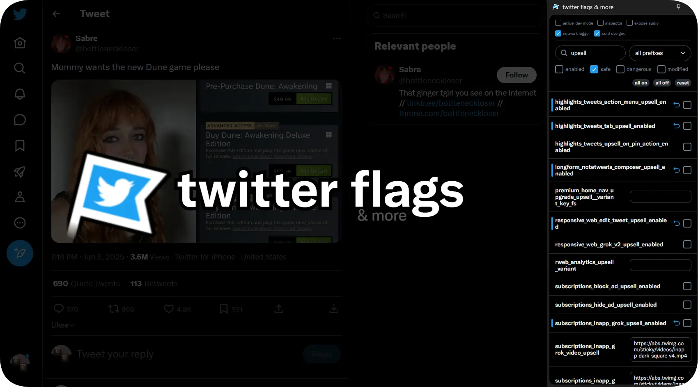

<h3 align="center">a simple interface to change feature flag values!</h3>
to install on chrome, simply clone the repository, enable developer mode in chrome extensions and "load unpacked", pointing to the cloned repo.   
to install on firefox, first turn it into a <b>zip file</b>, and disable extension verification through <code>xpinstall.signatures.required = false</code> in config, or through firefox nightly/dev.  
if neither work, then the firefox versions you're installing are too gated and you might need to find a workaround.
<h5>see also:</h5>
<table>
  <tr valign="center">
    <td>
      <a href="https://github.com/Swakshan/X-Flags/tree/main/flags"><b>@Swakshan/X-Flags</b></a> 
      an autoupdating list of feature flags across platforms
    </td>
    <td>
      <a href="https://chromewebstore.google.com/detail/x-twitter-feature-flags/phioeneleonlckednejcmajbkmhhiepm"><b>X / Twitter Feature Flags</b></a> 
      the original extension 
      (i made this one because changed settings don't properly persist across extension search results.. and also to add more stuff :p)
    </td>
    <td>
      <a href="https://gist.github.com/insin/48ad60824dcf85e4d72eb1e3a1819831"><b>@insin/script.js</b></a> 
      console snippet to change flag states
    </td>
  </tr>
</table>